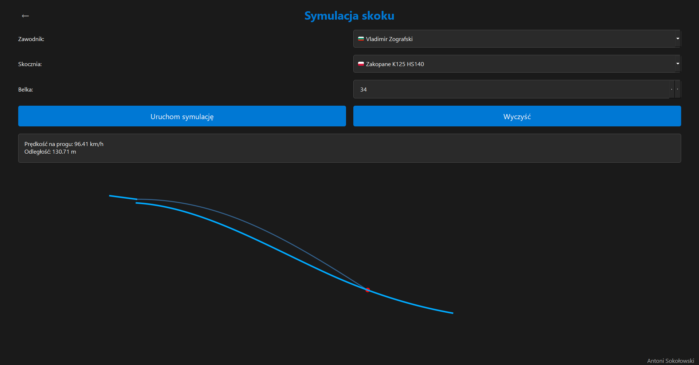
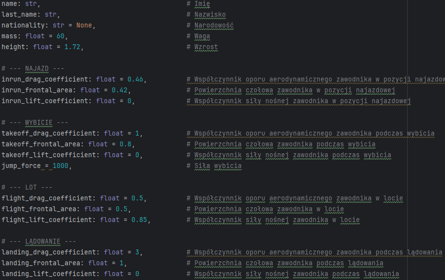
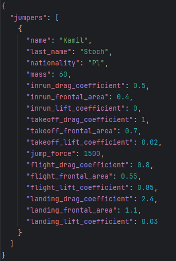
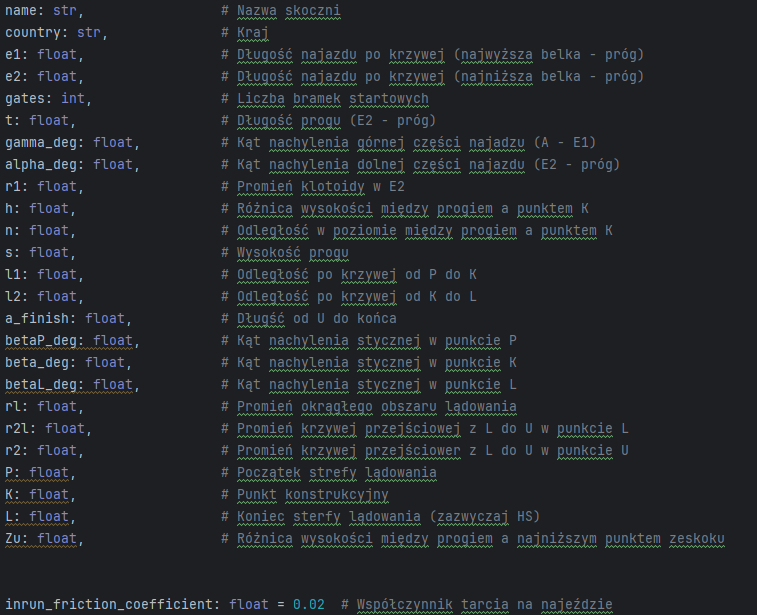

# SJS (Ski Jumping Simulator)


SJS is an advanced ski jumping simulator written in Python, utilizing a physics-based model to realistically represent the dynamics of a jumper's flight. The application features a complete graphical user interface built with the PySide6 (Qt for Python) library.

The simulation's data, including jumpers and hills, is loaded from an external `data/data.json` file, allowing users to easily customize and add their own content.

<p align="center">
  
</p>

---

## Key Features

* **Two Simulation Modes:**
    * **Single Jump:** Analyze a single jump by a selected athlete on a chosen hill.
    * **Competition:** Run a full, two-round competition for a group of selected jumpers, with results updated in real-time.
* **2D Flight Visualization:** A real-time graphical representation of the jump trajectory, created using `matplotlib`.
* **External & Editable Data:** The application loads all jumper and hill data from an external `data/data.json` file, making it easy to add, remove, or edit entries.
* **Customizable UI:** Users can choose between light and dark themes and adjust the interface contrast and volume.
* **Interactive Options:** Ability to select the start gate, dynamically sort the jumper list, and view distance-based results.

---

## Technology Stack

* **Language:** Python 3
* **GUI Framework:** PySide6 (Qt for Python)
* **Data Visualization:** Matplotlib
* **Numerical Computing:** NumPy
* **Scientific Computing:** SciPy
* **Image Manipulation:** Pillow (for creating rounded flag icons)
* **Packaging:** PyInstaller

---

## Installation and Usage

There are two ways to run the simulator.

### 1. For Users (Recommended)

This method is the easiest and does not require a Python installation.

1.  Navigate to the **[Releases](https://github.com/Antoni-Sokolowski/SJS_Simulator/releases)** section of this repository.
2.  Download the latest `.zip` package (e.g., `SJS_Simulator_v1.0.zip`).
3.  Unzip the package to a location on your computer.
4.  Run the application by double-clicking the `SJS_Simulator.exe` file.

**Important:** The `.exe` file must be in the **same folder** as the `data` directory to function correctly.

### 2. For Developers (From Source Code)

This method allows you to view and modify the code.

**Prerequisites:**
* Python 3.8+
* Git

**Steps:**

1.  **Clone the repository:**
    ```bash
    git clone [https://github.com/Antoni-Sokolowski/SJS_Simulator.git](https://github.com/Antoni-Sokolowski/SJS_Simulator.git)
    cd SJS_Simulator
    ```

2.  **Create and activate a virtual environment:**
    ```bash
    # Windows
    python -m venv .venv
    .venv\Scripts\activate
    ```

3.  **Install the required libraries:**
    ```bash
    pip install -r requirements.txt
    ```

4.  **Run the application:**
    ```bash
    python main.py
    ```

---

## Customization: Adding Jumpers & Hills

You can easily customize the simulator by editing the `data/data.json` file. All values should be expressed in base **SI units** (meters, kilograms, seconds).

### Jumper Data

Below is an overview of the available parameters for a jumper and an example of the JSON structure.

<table>
  <tr>
    <td valign="top"></td>
    <td valign="top"></td>
  </tr>
  <tr>
    <td align="center"><i>Jumper parameters available in the simulator.</i></td>
    <td align="center"><i>Example of a complete jumper entry in <code>data.json</code>.</i></td>
  </tr>
</table>

**Jumper Parameters:**

| Parameter                   | Description                                         | Required |
| --------------------------- | --------------------------------------------------- |:--------:|
| `name`                      | First name of the jumper.                           | **Yes** |
| `surname`                   | Last name of the jumper.                            | **Yes** |
| `nationality`               | Jumper's nationality (2-letter country code).     | **Yes** |
| `mass`                      | Weight of the jumper in kilograms.                  | No       |
| `height`                    | Height of the jumper in meters.                     | No       |
| `inrun_drag_coefficient`    | Drag coefficient on the inrun.                      | No       |
| `inrun_frontal_area`      | Frontal area on the inrun.                          | No       |
| `takeoff_drag_coefficient`  | Drag coefficient during takeoff.                    | No       |
| `takeoff_frontal_area`    | Frontal area during takeoff.                        | No       |
| `jump_force`                | Takeoff force in Newtons.                           | No       |
| `flight_drag_coefficient`   | Drag coefficient during flight.                     | No       |
| `flight_frontal_area`     | Frontal area during flight.                         | No       |
| `flight_lift_coefficient`   | Lift coefficient during flight.                     | No       |
| `landing_drag_coefficient`  | Drag coefficient during landing.                    | No       |
| `landing_frontal_area`    | Frontal area during landing.                        | No       |
| `landing_lift_coefficient`  | Lift coefficient during landing.                    | No       |

*If an optional parameter is not provided, a default value will be used.*

### Hill Data

The hill parameters are based on the official FIS (International Ski and Snowboard Federation) standards for ski jump construction. All parameters are required for the hill to be calculated correctly.

<table>
  <tr>
    <td valign="top"></td>
  </tr>
  <tr>
    <td align="center"><i>Example of a complete hill entry in <code>data.json</code>.</i></td>
  </tr>
</table>

**Hill Parameters:**

| Parameter                  | Description                                            | Required |
| -------------------------- | ------------------------------------------------------ |:--------:|
| `name`                     | Official name of the hill.                             | **Yes** |
| `country`                  | Country where the hill is located (2-letter code).   | **Yes** |
| `e1`, `e2`, `gates`        | Inrun parameters (lengths and number of gates).        | **Yes** |
| `t`, `gamma_deg`, `alpha_deg`, `r1` | Inrun geometry (takeoff table and transition curve). | **Yes** |
| `h`, `n`, `s`              | Key dimensions (takeoff height, K-point position).     | **Yes** |
| `betaP_deg`, `beta_deg`, `betaL_deg` | Landing slope angles at points P, K, and L.      | **Yes** |
| `rl`                       | Radius of the main landing area curve.                 | **Yes** |
| `P`, `K`, `L`              | Key points on the landing profile (P-point, K-point, L-point/HS). | **Yes** |
| `Zu`                       | Height difference to the lowest point of the outrun.   | **Yes** |
| `inrun_friction_coefficient` | Friction coefficient of the inrun tracks.              | No       |

For detailed information on these parameters, please refer to the official FIS documentation and homologation lists:
1.  **[FIS Construction Norms](https://assets.fis-ski.com/f/252177/5ba64e29f2/construction-norm-2018-2.pdf)** (PDF)
2.  **[FIS Homologated Hills Database](https://www.fis-ski.com/DB/alpine-skiing/homologations.html)**

---

# THANKS FOR READING

---

## License

This project is licensed under the MIT License. See the `LICENSE` file for more details.
