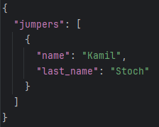

# SJS (Ski Jumping Simulator)


SJS is an advanced ski jumping simulator written in Python, utilizing a physics-based model to realistically represent the dynamics of a ski jumper's flight. The application features a graphical user interface built with the PySide6 (Qt for Python) library.

The simulation's data (jumpers and hills) is loaded from an external `data.json` file, allowing users to easily customize and add their own content.


---

## Key Features

* **Two Simulation Modes:**
    * **Single Jump:** Analyze a single jump by a selected athlete on a chosen hill.
    * **Competition:** Run a full, two-round competition for a group of selected jumpers, with results updated in real-time.
* **2D Flight Visualization:** A real-time graphical representation of the jump trajectory, created using `matplotlib`.
* **External & Editable Data:** The application loads all jumper and hill data from an external `data/data.json` file. Users can easily add, remove, or edit entries.
* **Customizable UI:** Users can choose between light and dark themes and adjust the interface contrast and volume.
* **Interactive Options:** Ability to select the start gate, dynamically sort the jumper list by name or country, and view distance-based results.

---

## Technology Stack

* **Language:** Python 3
* **GUI Framework:** PySide6 (Qt for Python)
* **Data Visualization:** Matplotlib
* **Numerical Computing:** NumPy
* **Scientific Computing:** SciPy
* **Image Manipulation:** Pillow (for creating rounded flag icons)
* **Packaging:** PyInstaller

---

## Installation and Usage

There are two ways to run the simulator.

### 1. For Users (Recommended)

This method is the easiest and does not require a Python installation.

1.  Navigate to the **[Releases](https://github.com/Antoni-Sokolowski/SJS_Simulator/releases)** section of this repository.
2.  Download the latest `.zip` package (e.g., `SJS_Simulator_v1.0.zip`).
3.  Unzip the package to a location on your computer.
4.  Run the application by double-clicking the `SJS_Simulator.exe` file.

**Important:** The `.exe` file must be in the **same folder** as the `data` directory to function correctly.

### 2. For Developers (From Source Code)

This method allows you to view and modify the code.

**Prerequisites:**
* Python 3.8+
* Git

**Steps:**

1.  **Clone the repository:**
    ```bash
    git clone [https://github.com/YOUR_USERNAME/SJS_Simulator.git](https://github.com/YOUR_USERNAME/SJS_Simulator.git)
    cd SJS_Simulator
    ```

2.  **Create and activate a virtual environment:**
    ```bash
    # Windows
    python -m venv .venv
    .venv\Scripts\activate
    ```

3.  **Install the required libraries:**
    ```bash
    pip install -r requirements.txt
    ```

4.  **Run the application:**
    ```bash
    python main.py
    ```

---

## Customization (Adding Jumpers & Hills)

You can easily add your own jumpers and hills by editing the `data/data.json` file. I'll show you how to do it below.

### Important info: Each value is expressed in base SI units


* **Jumpers**


Here you can see all the statistics you can set for the jumper in SJS. I will explain each one of these below:
* **name** - First name of the jumper.*
* **last_name** - Last name of the jumper.*
* **nationality** - Nationality of the jumper.
* **mass** - Weight of the jumper.
* **height** - Height of the jumper.
* **inrun_drag_coefficient** - Drag coefficient of the jumper on inrun. Default is 0.46.
* **inrun_frontal_area** - Frontal area of the jumper on inrun. Default is 0.42.
* **inrun_lift_coefficient** - Lift coefficient of the jumper on inrun. Default is 0.
* **takeoff_drag_coefficient** - Drag coefficient of the jumper during takeoff. Default is 1.
* **takeoff_frontal_area** - Frontal area of the jumper during takeoff. Default is 0.8.
* **takeoff_lift_coefficient** - Lift coefficient of the jumper during takeoff. Default is 0.
* **jump_force** - Jump force of the jumper on takeoff. Default is 1000.
* **flight_drag_coefficient** - Drag coefficient of the jumper during the flight. Default is 0.5.
* **flight_frontal_area** - Frontal area of the jumper during the flight. Default is 0.85.
* **landing_drag_coefficient** - Drag coefficient of the jumper during landing. Default is 3.
* **landing_frontal_area** - Frontal area of the jumper during landing. Default is 1.
* **landing_lift_coefficient** - Lift coefficient of the jumper during landing. 0

A lot of data, right? But it is fun!

I know what each parameter does, but where I can edit them?
The data heart in SIS comes to the rescue.

The heart can be found in the following location: **data\data.json**

Let us create our jumper!



That is it! We have just created our fisrt jumper.

I know what are you thinking right now. "He explained us 100 jumper's statistic just to enter first name and surname in the file??"" - This is exactly what I did.
You can scroll up a little, dou you see the stairs on the right side of the statistics I was explaining? No? Yeah, not so easy because there are only two.
They mean that the input is mandatory. You can not create jumper without typing his name and surname. We did not type any statistics for our jumper so he will use the default ones.
I have to warn you, they are not the best. Of course you can enter all the statistics and it should look like this.


Good job! Now you are able to create, edit or even delete any jumper!


* **Hills**


Here you can see all the statistics you can set for the hill in SJS.
* **name** *
* **country** *
* **e1** *
* **e2** *
* **gates** *
* **t** *
* **gamma_deg** *
* **alpha_deg** *
* **r1** *
* **h** *
* **n** *
* **s** *
* **l1** *
* **l2** *
* **a_finish** *
* **betaP_deg** *
* **beta_deg** *
* **betaL_deg** *
* **rl** *
* **r2l** *
* **r2** *
* **P** *
* **K** *
* **L** *
* **Zu** *
* **inrun_friction_coefficient** - Friction coefficient of the inrun. Default is 0.02 (ice tracks).

This is definitely more complicated than setting parameters for jumper, is not it?
You should ask why did I invented that weird nomenclature and the answer is quite easy. I did not. International Ski and Snowboard Federation did.

Here you got 2 doucemnts, the first one is about specifically about these parameters and how to use them and the second one is the website where you can view homologation of real hills and their parameters. Play around with it!
1: https://assets.fis-ski.com/f/252177/5ba64e29f2/construction-norm-2018-2.pdf
2: https://www.fis-ski.com/DB/alpine-skiing/homologations.html

One more thing, yeah each of these is mandatory to input. Without it the SJS will not work. You can do that same way as adding jumper in **data\data.json**


---

## Building from Source

This project uses a `.spec` file for reliable builds with PyInstaller.

1.  Make sure all dependencies from `requirements.txt` are installed.
2.  Run the following command from the project's root directory:
    ```bash
    pyinstaller main.spec
    ```
3.  The final executable will be located in the `dist` folder. Remember to package it with the `data` folder for distribution.

---

## License

This project is licensed under the MIT License. See the `LICENSE` file for more details.
